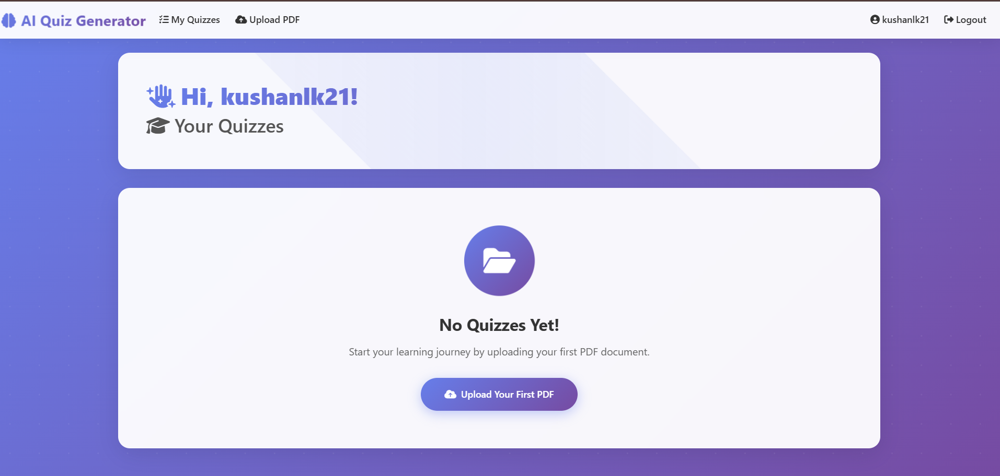
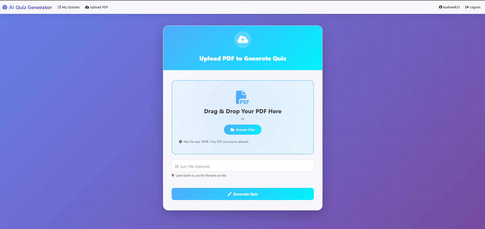

# 🧠 AI Quiz Generator

A modern, intelligent web application that automatically generates interactive quizzes from PDF documents using AI. Built with Flask and featuring a stunning, animated user interface.


## 📸 Screenshots

### Dashboard

*Beautiful dashboard showing all your generated quizzes*

### Upload Interface

*Drag-and-drop PDF upload with real-time preview*

## ✨ Features

- 🤖 **AI-Powered Quiz Generation** - Automatically creates questions from PDF content
- 📁 **Drag & Drop Upload** - Modern file upload interface with drag-and-drop support
- 📊 **Progress Tracking** - Real-time progress bar during quiz attempts
- 🎨 **Beautiful UI** - Modern, animated interface with gradient designs
- 📱 **Fully Responsive** - Works seamlessly on desktop, tablet, and mobile
- 🔐 **User Authentication** - Secure login and registration system
- 📈 **Detailed Results** - Comprehensive answer breakdown with visual feedback
- 💾 **Quiz History** - Save and revisit your quizzes anytime
- 🎯 **Interactive Questions** - Smooth animations and hover effects
- 🌈 **Glass-Morphism Design** - Modern UI with backdrop blur effects

## 🚀 Getting Started

### Prerequisites

- Python 3.8 or higher
- pip (Python package installer)
- Virtual environment (recommended)
- MYSQL

### Installation

1. **Clone the repository**
   ```bash
   git clone https://github.com/KushanLaksitha/ai-quiz-generator.git
   cd ai-quiz-generator
   ```

2. **Create a virtual environment**
   ```bash
   python -m venv venv
   
   # On Windows
   venv\Scripts\activate
   
   # On macOS/Linux
   source venv/bin/activate
   ```

3. **Install dependencies**
   ```bash
   pip install -r requirements.txt
   ```

4. **Set up environment variables**
   
   Create a `.env` file in the root directory:
   ```env
   FLASK_APP=app.py
   FLASK_ENV=development
   SECRET_KEY=your-secret-key-here
   DATABASE_URL=sqlite:///quiz.db
   OPENAI_API_KEY=your-openai-api-key
   ```

5. **Initialize the database**
   ```bash
    mysql -u root -p

   ```
   and create the database using schema.sql

6. **Run the application**
   ```bash
   flask run
   ```

7. **Open your browser**
   
   Navigate to `http://localhost:5000`

## 📦 Project Structure

```
ai-quiz-generator/
│
├── app/
│   ├── __init__.py
│   ├── models.py              # Database models
│   ├── routes.py              # Application routes
│   ├── forms.py               # WTForms forms
│   ├── utils.py               # Utility functions
│   │
│   ├── templates/
│   │   ├── base.html          # Base template
│   │   ├── index.html         # Dashboard
│   │   ├── login.html         # Login page
│   │   ├── register.html      # Registration page
│   │   ├── upload.html        # PDF upload
│   │   ├── quiz.html          # Quiz interface
│   │   └── result.html        # Results page
│   │
│   └── static/
│       ├── css/
│       │   └── style.css      # Custom styles
│       └── js/
│           └── script.js      # Custom scripts
│
├── migrations/                # Database migrations
├── uploads/                   # Uploaded PDF files
├── requirements.txt           # Python dependencies
├── config.py                  # Configuration
├── run.py                     # Application entry point
└── README.md                  # This file
```

## 🛠️ Technologies Used

### Backend
- **Flask** - Web framework
- **SQLAlchemy** - ORM for database operations
- **Flask-Login** - User session management
- **Flask-Migrate** - Database migrations
- **WTForms** - Form handling and validation
- **PyPDF2** - PDF text extraction
- **OpenAI API** - AI-powered quiz generation

### Frontend
- **Bootstrap 5** - CSS framework
- **Font Awesome** - Icon library
- **Custom CSS** - Gradient designs and animations
- **Vanilla JavaScript** - Interactive features

### Database
- **SQLite** - Development database
- **PostgreSQL** - Production database (recommended)

## 📚 Usage

### Creating Your First Quiz

1. **Register an Account**
   - Click on "Register" in the navigation
   - Fill in your details
   - Click "Register"

2. **Upload a PDF**
   - Navigate to "Upload PDF"
   - Drag and drop your PDF or click to browse
   - Optionally provide a custom quiz title
   - Click "Generate Quiz"

3. **Take the Quiz**
   - Select your answers for each question
   - Track your progress with the progress bar
   - Click "Submit Quiz" when done

4. **View Results**
   - See your score with animated visualization
   - Review each question with detailed feedback
   - Understand correct and incorrect answers

## 🎨 UI/UX Features

- **Animated Backgrounds** - Dynamic gradient patterns
- **Glass-Morphism Effects** - Modern backdrop blur styling
- **Smooth Transitions** - All interactions are animated
- **Hover Effects** - Interactive feedback on all elements
- **Progress Indicators** - Real-time quiz progress tracking
- **Responsive Design** - Works on all screen sizes
- **Color-Coded Feedback** - Visual distinction for correct/incorrect
- **Staggered Animations** - Sequential entrance effects

## 🔧 Configuration

### Database Configuration

For development:
```python
SQLALCHEMY_DATABASE_URI = 'sqlite:///quiz.db'
```

For production:
```python
SQLALCHEMY_DATABASE_URI = os.environ.get('DATABASE_URL')
```

### File Upload Settings

```python
MAX_CONTENT_LENGTH = 16 * 1024 * 1024  # 16MB max file size
ALLOWED_EXTENSIONS = {'pdf'}
```

## 🚢 Deployment

### Heroku

1. Create a `Procfile`:
   ```
   web: gunicorn app:app
   ```

2. Install Gunicorn:
   ```bash
   pip install gunicorn
   pip freeze > requirements.txt
   ```

3. Deploy:
   ```bash
   heroku create your-app-name
   git push heroku main
   heroku run flask db upgrade
   ```

### Docker

1. Create a `Dockerfile`:
   ```dockerfile
   FROM python:3.9-slim
   WORKDIR /app
   COPY requirements.txt .
   RUN pip install -r requirements.txt
   COPY . .
   CMD ["flask", "run", "--host=0.0.0.0"]
   ```

2. Build and run:
   ```bash
   docker build -t ai-quiz-generator .
   docker run -p 5000:5000 ai-quiz-generator
   ```

## 🤝 Contributing

Contributions are welcome! Please feel free to submit a Pull Request.

1. Fork the repository
2. Create your feature branch (`git checkout -b feature/AmazingFeature`)
3. Commit your changes (`git commit -m 'Add some AmazingFeature'`)
4. Push to the branch (`git push origin feature/AmazingFeature`)
5. Open a Pull Request

## 📝 License

This project is licensed under the MIT License - see the [LICENSE](LICENSE) file for details.

## 👨‍💻 Author

**Kushan Kumarasiri**
- Email: kushanlaksitha32@gmail.com
- GitHub: [@KushanLaksitha](https://github.com/kushankumarasiri)

## 🙏 Acknowledgments

- OpenAI for the GPT API
- Bootstrap team for the CSS framework
- Font Awesome for the icon library
- Flask community for the excellent documentation

## 📞 Support

If you have any questions or need help, please:
- Open an issue on GitHub
- Email: kushanlaksitha32@gmail.com

## 🗺️ Roadmap

- [ ] Add support for multiple file formats (DOCX, TXT)
- [ ] Implement quiz difficulty levels
- [ ] Add timer functionality for quizzes
- [ ] Create leaderboard system
- [ ] Add quiz sharing capabilities
- [ ] Implement question bank management
- [ ] Add export functionality (PDF reports)
- [ ] Multi-language support
- [ ] Dark mode toggle
- [ ] Social media integration

## 📊 Project Status

This project is actively maintained and under continuous development. Feel free to star ⭐ the repository if you find it useful!

---

Made with ❤️ by Kushan Kumarasiri